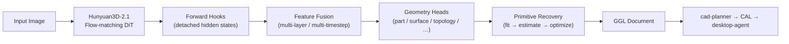

# Geometry Engine

**Stage 2 of the [AI CAD OS](../README.md) pipeline** — the bridge between a
generative 3D model and a *parametric, editable* CAD construction tree.

The Geometry Engine does something unusual: instead of reading the **mesh** that
an image-to-3D diffusion model produces, it reaches *inside* the model and reads
its **intermediate hidden states**. Those latent representations still contain the
structural intent of the object (parts, primitives, symmetry, topology) *before*
they are collapsed into raw triangles. The engine probes those states with a bank
of prediction **heads**, recovers analytic **primitives**, and emits a
**Geometry Graph Language (GGL)** document that the downstream CAD Planner turns
into real modeling operations.



> **Architecture invariant:** the generated **mesh is never used as the source
> for CAD reconstruction**. The GGL is *always* derived from DiT hidden states
> captured via forward hooks. Meshes are only ever used for *visualization* or
> *verification*. This rule is enforced at runtime by
> `verification/foundation_check.py`.

---

## Table of Contents

- [What it produces: GGL](#what-it-produces-ggl)
- [The pipeline, version by version](#the-pipeline-version-by-version)
- [Repository layout](#repository-layout)
- [Module reference](#module-reference)
- [Installation](#installation)
- [Quick start](#quick-start)
- [REST API](#rest-api)
- [Configuration](#configuration)
- [Testing](#testing)
- [Docker](#docker)
- [Where this sits in AI CAD OS](#where-this-sits-in-ai-cad-os)

---

## What it produces: GGL

The output is a **Geometry Graph Language** document — a typed, directed graph of
geometric evidence:

- **Nodes** describe geometry at multiple levels of abstraction: `Part`
  (oriented bounding boxes), `Surface` (normals, curvature), and `Primitive`
  (a fitted Cylinder / Box / Sphere / Cone / Plane / Torus with parameters and a
  confidence score).
- **Edges** describe relationships between them: containment/hierarchy
  (`Part → Surface → Primitive`), `Symmetric`, `Instantiates`, and topological
  constraints (perpendicular, coaxial, coplanar, adjacent).

The GGL schemas are **not defined here** — they are re-exported from the
repo-wide `shared-schemas` package (see `graph/ggl.py`) so that every stage of AI
CAD OS speaks exactly the same types.

---

## The pipeline, version by version

The engine was built in incremental "versions", and the master runner
`scripts/run_all.py` executes them in order:

| Version | Stage | What happens |
|---------|-------|--------------|
| **V0** | Hook validation | Unit-test the forward-hook feature extractor to prove hidden states are captured correctly. |
| **V1** | Temporal probing | Run PCA / layer-importance ranking over DiT layers × diffusion timesteps to find *which* representations carry geometric structure. |
| **V2** | Graph extraction | Fuse the selected features and run the **geometry heads** to produce a raw GGL graph. |
| **V3** | Primitive recovery | Propose candidate primitives per part, estimate their parameters, and jointly optimize for geometric consistency. |
| **V4 + V5** | GGL export & CAD macro | Serialize the final GGL and hand it to the CAD Planner for macro generation. |

Each run writes intermediate artifacts under `experiments/` and `logs/exports/`.

---

## Repository layout

```
geometry-engine/
├── api/
│   └── main.py                 # FastAPI REST server (5 endpoints + /health)
├── hooks/
│   └── feature_extractor.py    # forward hooks that capture DiT hidden states
├── integration/
│   └── model_bridge.py         # loads Hunyuan3D DiT, wires hooks, runs inference
├── encoder/
│   └── feature_fusion.py       # fuse multi-layer / multi-timestep features
├── probing/
│   └── analyzer.py             # PCA + layer-importance ranking (V1)
├── heads/
│   ├── base.py                 # GeometryHeadBase (abstract)
│   ├── loader.py               # plugin registry — heads loaded from config
│   ├── part.py                 # part detection + oriented bounding boxes
│   ├── primitive.py            # 6-way primitive classifier + param regressors
│   ├── surface.py              # surface normals + principal curvature
│   ├── symmetry.py             # bilateral / rotational symmetry
│   └── topology.py             # spatial relations between primitives
├── graph/
│   ├── ggl.py                  # re-export authoritative GGL schemas
│   ├── ggl_builder.py          # dedup + hierarchy + symmetry linking + validate
│   └── generator.py            # runs heads → builds the GGL graph
├── primitive/
│   ├── generator.py            # primitive proposal generation
│   ├── fitting.py              # RANSAC / least-squares shape fitting
│   ├── estimator.py            # extract dimensions from coordinate clusters
│   ├── optimizer.py            # joint non-linear consistency optimizer (L-BFGS-B)
│   └── uncertainty.py          # per-parameter covariance / confidence
├── refinement/
│   ├── loop.py                 # iterative image→CAD→verify→refine feedback loop
│   ├── comparator.py           # geometry difference between target and result
│   └── convergence.py          # plateau / oscillation / divergence detection
├── verification/
│   ├── foundation_check.py     # asserts DiT-hidden-state-only invariant
│   └── orchestrator.py         # aggregates Chamfer/Hausdorff/IoU into a report
├── tracking/experiment.py      # JSON-lines experiment / metric tracker
├── visualization/plotter.py    # probing research plots (matplotlib/seaborn)
├── cad/__init__.py             # NOTE: schemas only — macro generation lives in cad-planner
├── configs/
│   ├── default.yaml            # global configuration
│   └── schema.py               # config validation
├── utils/                      # ConfigManager, ExperimentLogger
├── scripts/                    # per-version runners + run_all.py
├── tests/                      # pytest suite
├── Dockerfile                  # multi-stage build, /health probe, non-root
├── requirements.txt
└── setup.py
```

---

## Module reference

### Feature capture — `hooks/`, `integration/`, `encoder/`
- **`hooks/feature_extractor.py`** registers `forward_pre_hook`s on the DiT's
  transformer blocks and saves the hidden states at target diffusion timesteps.
  (It uses `with_kwargs=True` on PyTorch ≥ 2.0 so the `timestep` kwarg is not
  silently dropped, with a positional-arg fallback for older PyTorch.)
- **`integration/model_bridge.py`** loads the Hunyuan3D DiT from
  `MODEL_GENERATOR_V2`, attaches the hooks to its `double_blocks` / `single_blocks`,
  runs diffusion inference, and returns the captured features.
- **`encoder/feature_fusion.py`** merges hidden states across layers and timesteps
  into a single geometry-rich tensor (weighted-mean, concat+project, or gated
  fusion).

### Probing — `probing/analyzer.py`
Runs PCA and ranks transformer layers by geometric variance, so downstream heads
consume only the most informative representations (V1).

### Geometry heads — `heads/`
All heads subclass **`GeometryHeadBase`** and implement `forward()` (raw tensors)
and `to_ggl_nodes()` (tensors → GGL nodes). They are **plugins**: `loader.py`
instantiates exactly the heads named in `configs/default.yaml` (`heads.enabled`),
so you can add/remove capabilities without touching code.

| Head | Predicts |
|------|----------|
| `part` | Part presence + oriented bounding box (center, extents, rotation quaternion). |
| `primitive` | 6-way class (Cylinder/Box/Sphere/Cone/Plane/Torus) + per-type dimension regressors. |
| `surface` | Unit normals `[nx, ny, nz]` and principal curvatures `[k1, k2]`. |
| `symmetry` | Bilateral reflection planes and rotational axes. |
| `topology` | Pairwise spatial constraints (perpendicular, coaxial, coplanar, adjacent). |

### Graph assembly — `graph/`
`generator.py` runs the enabled heads and feeds their predictions to
`ggl_builder.py`, which (1) **deduplicates** overlapping predictions by spatial
proximity, (2) builds the **containment hierarchy** via nearest-centroid matching,
(3) links **symmetric** primitives across reflection planes, and (4) **validates**
connectivity so there are no orphan nodes.

### Primitive recovery — `primitive/`
Turns noisy predicted coordinates into clean analytic primitives:
`generator.py` proposes candidates → `fitting.py` robustly fits shapes
(RANSAC / least-squares) → `estimator.py` extracts dimensions → `optimizer.py`
jointly snaps near-orthogonal/parallel features to exact angles (L-BFGS-B) →
`uncertainty.py` attaches a covariance/confidence to each parameter.

### Refinement & verification — `refinement/`, `verification/`
`refinement/loop.py` closes the full feedback loop
(*Image → Geometry Engine → GGL → CAD Planner → CAL → Desktop Agent → CAD software
→ exported mesh → verification → geometry diff → refined GGL → repeat*), with
convergence detection. `verification/orchestrator.py` aggregates geometric metrics
(Chamfer, Hausdorff, IoU, normal consistency) into a single `VerificationReport`
and provides pass/fail gates. `verification/foundation_check.py` enforces the
DiT-hidden-state-only invariant before any run.

---

## Installation

Requires **Python ≥ 3.8** (the Docker image uses 3.11).

```bash
# editable install (recommended)
pip install -e .

# or just the dependencies
pip install -r requirements.txt
```

Core dependencies: `torch`, `numpy`, `scikit-learn`, `pydantic`, `PyYAML`,
`fastapi`, `uvicorn`, `matplotlib`, `seaborn`, `Pillow`. The full Hunyuan3D
feature-extraction path (`diffusers`, `transformers`, `accelerate`) is optional
and commented in `requirements.txt`; without it the API and pipeline still run
using **mock features** so you can exercise the graph/primitive/export stages
without a GPU or model weights.

---

## Quick start

Run the whole pipeline (V0 → V5) and print a pass/fail report:

```bash
python scripts/run_all.py
```

Or run an individual stage:

```bash
python scripts/run_probing.py              # V1 – temporal probing
python scripts/run_graph_extraction.py     # V2 – heads → GGL
python scripts/run_primitive_recovery.py   # V3 – primitive fitting
python scripts/run_ggl_export.py           # V4/V5 – GGL export
python scripts/extract_features.py         # DiT feature extraction (needs weights)
```

Artifacts land in `experiments/experiment_<timestamp>/` and `logs/exports/`.

---

## REST API

Start the server:

```bash
uvicorn api.main:app --host 0.0.0.0 --port 8000 --reload
# or: python api/main.py
```

| Method & path | Purpose |
|---------------|---------|
| `GET  /health` | Readiness probe for Docker/K8s. |
| `POST /extract_features` | Describes how to hook the DiT (real run via `scripts/extract_features.py`). |
| `POST /probe` | PCA + layer ranking over saved `.npy` feature files. |
| `POST /generate_graph` | Runs (mock) features through the geometry heads → GGL JSON. |
| `POST /primitive_fit` | Proposal → estimation → optimization on a GGL document. |
| `POST /export_ggl` | Translates GGL into a CAD macro (delegates to the CAD Planner). |

Example:

```bash
curl -s http://localhost:8000/generate_graph \
  -H "Content-Type: application/json" \
  -d '{"feature_dim":1024,"num_tokens":256,"enabled_heads":["part","surface","topology"]}'
```

> Note: `/export_ggl` calls a `CADPlanner`. In AI CAD OS, GGL → CAL macro
> generation is the exclusive responsibility of the sibling **`cad-planner`**
> project — the local `cad/` package here intentionally holds *schemas only*
> (see `cad/__init__.py`).

---

## Configuration

All behavior is driven by `configs/default.yaml`, loaded through
`utils.config.ConfigManager` and validated by `configs/schema.py`. Key sections:

```yaml
extraction:                 # V1 – which timesteps/layers to keep
  target_timesteps: [0.1, 0.3, 0.5, 0.7, 0.9]
  top_layers: 5
  top_timesteps: 3

heads:                      # V2 – plugin heads to run
  enabled: [part, surface, topology]
  confidence_threshold: 0.8
  hidden_dim: 1024
  num_heads: 8
  dropout: 0.1

primitive:                  # V3 – recovery + optimization
  top_k_proposals: 3
  optimizer: ransac         # least_squares | ransac | gauss_newton | lm
  max_iterations: 100
  tolerance: 1e-4

ggl:                        # V4 – schema version
  version: "1.0"
  schema: "geometry_graph_language"

logging:
  base_dir: "logs"
  experiments_dir: "experiments"
  save_intermediate_tensors: true
```

Add `symmetry` (and other) heads to `heads.enabled` to expand the graph when the
evidence supports it.

---

## Testing

```bash
pytest -q
```

The suite covers hooks (`test_hooks.py`), heads (`test_heads.py`), primitive
fitting (`test_fitting.py`), integration (`test_integration.py`), and the
end-to-end pipeline (`test_pipeline.py`).

---

## Docker

A multi-stage, non-root image with a built-in health check is provided:

```bash
docker build -t geometry-engine .
docker run -p 8000:8000 geometry-engine
# then: curl http://localhost:8000/health
```

The builder stage installs the CPU PyTorch wheels; swap the `--extra-index-url`
in the `Dockerfile` for a CUDA index (e.g. `cu121`) to build a GPU image.

---

## Where this sits in AI CAD OS

| Stage | Project | Role |
|-------|---------|------|
| 1 | `MODEL_GENERATOR_V2` | Hunyuan3D-2.1 DiT — generates the mesh **and exposes hidden states**. |
| **2** | **`geometry-engine`** (this repo) | Probes hidden states → recovers primitives → emits **GGL**. |
| 3 | `cad-planner` | GGL → **CAL** (intent, beam-search planning, manufacturability). |
| 4 | `desktop-agent` | Executes CAL in CAD software (FreeCAD / SolidWorks) + verification loop. |

Shared types for every stage live in `shared-schemas`.
